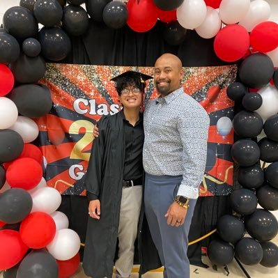

[//]: # ()
[//]: # ()

<!-- Styling -->

<!-- End Styling -->

# family-directory
## A family directory where a user can easily and quickly find known and yet to be known members of their family. Immediate family, in-laws, extended family - see everyone you're related to here!
&thinsp; &thinsp;
## How You Can Collaborate With Us
#### Contact me or anyone of the Project Owners or Engineering Leads via anyone of the contact methods below and we may then invite you as a collaborator to the project, as well as the projects Discord server and kanban board. 
&thinsp;
### 1. `cd` into the local directory you'll want to work from.
- `$ cd Desktop/`
### 2. Clone the github repository.
- `$ git clone https://github.com/richardxessien/family-directory.git`
### 3. `cd` into local repository.
- `$ cd family-directory/`
### 4. Create a new branch.
- `$ git checkout -b branch-name`
### 5. After making your changes and before pushing your code to the remote repository, ensure you pull the latest changes to avoid possible merge conflicts.
- `$ git pull origin main`
### 6. Stage changes that are to be committed. Multiple files
- `$ git add file-name(s)` or `$ git add .`
### 7. Commit your changes.
- `$ git commit -m "Short Description of Change(s) Made"`
### 8. Push changes to remote repository via your branch
- `$ git push origin branch-name`

&thinsp;
##### **Pull requests will be reviewed by 2 Engineering Leads before merging.***

&thinsp;
## Collaborators
&thinsp;
<section id="collab-cards">
    

        
        
Essien, Richard | <em>Project Owner</em> | <em>Lead Engineer</em>

        <article class="social-contacts">
            
             
            
            
        </article>
    

    

        
        
Meyers, Lewis | <em>Lead Engineer</em>

        <article class="social-contacts">
            
             
            
            
        </article>
    

</section>